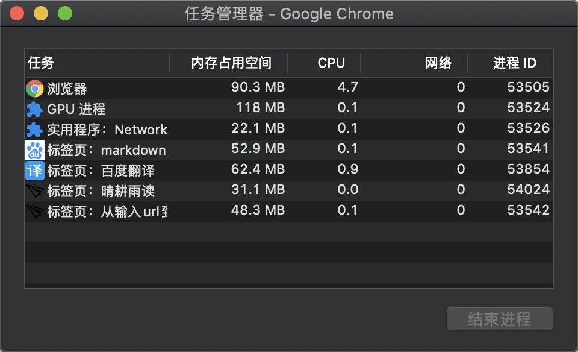

## 一、DNS 查询
如果输入的是域名，需要进行DNS解析成IP（Internet Protocol）
### what's DNS ？
DNS即是Domain Name System，单从字面上理解即是域名系统，其实是用来管理域名&IP的对应关系。
### 域名
既然DNS是管理域名&IP的对应关系的系统，那么我们来看下域名。首先举个例子`www.baidu.com.`

1. 域名的层级
    
    在讨论域名的时候，经常能听到「顶级域名」、「一级域名」、「二级域名」、「子域」等概念，那么域名的层级究竟是怎么划分的呢？
    - 根域名。以百度为例，有细心的朋友发现最后有个`.`，这不是错误，而是所有的域名尾部都有一个跟域名。`www.baidu.com`完整写法为，`www.baidu.com.root`，简写为`www.baidu.com`。因为是根域名，所有的域名都一样，所以平时都是省略的，最终变成了我们日常使用的样子。IPv4根域名服务器全球一共只有13台分别以A-M标记，一台主根服务器在美国，其余12台皆为辅根服务器，他们负责管理世界各国的域名信息。至于为什么只有13台可以看知乎回答，[为什么域名根服务器只能有13台呢](https://www.zhihu.com/question/22587247/answer/66417484)回答得非常详细。
    - 根域名的下一级是顶级域名（top-level domain 简写为TLD），也叫做一级域名。常见的一级域名有「.cn」「.net」「.org」「.com」等等，在百度的域名中.com就是一级域名。
    - 二级域名。一级域名下一级叫做二级域名（second-level domain 简称为SLD），在百度域名中，`baidu.com`就是二级域名。这是通常我们可以购买和注册的最高级域名了。
    - 二级域名之下就是主机域名（host）了，也可以叫三级域名，如`www.baidu.com`就是三级域名
    - 子域。子域是个相对的概念，`baidu.com`是`.com`的子域

2. 域名的解析
与域名的层级结构一样，DNS系统也是一个树状结构。不同的域名由不同的层级的域名服务器来解析，整个过程就是一个「层级式」的。但每次输入域名回车后不是每次都会去查询，首先还会经过几个步骤：

  - 1) 浏览器缓存。这里的缓存不是指资源缓存而是对于域名对应IP的缓存，如果有则解析过程贼会结束，并且使用缓存结果。当然域名缓存也是有限制的，包括缓存时间、大小，可以通过TTL属性设置。

  - 2）本地hosts文件。对于开发者来说，hosts文件并不陌生，修改hosts文件可以做到某域名直接映射到某IP，比如在hosts文件中新增`www.baidu.com  127.0.0.1`那么访问百度域名就会直接访问本地127.0.0.1。如果用户的浏览器中没有缓存则会首先检查在hosts文件中该域名是否有被映射，如果有解析过程结束，使用该结果。

  - 3）本地DNS解析器缓存。如果hosts文件未得到想要的结果，则查找本地DNS解析器缓存，是否有该域名的映射关系，如果有，直接返回，完成域名解析。

  - 4）本地DNS服务器。如果本地DNS解析器缓存没有得到想要的结果，会找到TCPg/ip参数中设置的首选DNS服务器，一般称之为本地DNS服务器。此服务器收到查询请求时，如果要查询的域名，包含在本地区域配置的资源中，则直接返回给客户端，完成解析，这样的解析结果具有权威性。

  - 5）本地DNS服务器缓存。如果要查询的域名不包含在本地DNS服务器的资源中，但是已经缓存了该地址的映射关系，则会返回该结果给客户端，完成解析，这样的解析结果不具有权威性。

  - 6）如果本地DNS服务器缓存也未能查询到想要的结果，就会根据本地DNS的配置项（是否设置转发），如果没有设置转发，则会将请求发送到13台根服务器，根服务器收到请求后会判断该域名由谁来授权管理的，将会返回一个负责该顶级域名的服务器的IP。本地DNS服务器接收到IP后，将会通过IP练习到到这台服务器。这台服务器接收到请求后，如果不能自己解析，则会找一个管理该域名的下一级DNS服务器地址给本地DNS服务器。本地DNS重复上述动作，直到找到该域名的负责服务器。

  - 7）如果本地DNS服务器设置的转发，此DNS服务器会将转发至上一级的DNS服务器，如果上一级的DNS服务器也无法解析，则会找到上上级，如此循环直到找到根服务器或者找到能解析该域名的服务器。不管本地服务器设置了转发还是未转发，最后都是将解析结果发送至本地DNS服务器，由本地DNS服务器发送给客户端。
### DNS查询总结
DNS查询发起前要经过本地的浏览器缓存、本地hosts文件映射、本地DNS解析器及缓存的检查，没有找到想要的结果然后才会将请求发送到本地DNS服务器，本地DNS服务能解析的都直接解析掉，不能解析的要借助上级乃至于根服务器的帮助。而又因为「层级结构」的原因，查询方式又有两种，递归查询和迭代查询，递归查询是直接求助根服务器的，而迭代查询是求助于上级直至根服务器的帮助。

## 二、浏览器发送请求
在完成DNS查询，客户端也就是浏览器接收到了目标IP，开始发起请求。那么浏览器是通过什么发送请求的呢？在这之前我们先要了解浏览器的工作原理，讨论到这里经常可以听到一些「多进程」、「单线程」的概念，我们继续探究。
### 多进程浏览器
1. 线程与进程。
    - 进程是cpu资源分配的最小单位（是拥有独立资源和独立运行的最小单位，进程间也可以通信，但是代价很大）
    - 线程是cpu调度的最小单位（线程是建立在进程的基础上的一次程序运行单位，但是一个进程是可以拥有多个线程的）
2. 多进程浏览器
    
    - 可以看到浏览器是多进程的，并且每个Tab页都有自己独立的进程（个别浏览器会做优化，比如讲多个空白Tab页合并一个进程）
    - 每个进程CPU都为其分配了内存空间和cpu，所以电脑不好的同学Tab页凯多了电脑会变卡，要及时关闭无用Tab页
3. 浏览器都有哪些进程
    - 1）Browser进程：浏览器主进程，只要打开浏览器就会存在，只会有一个负责协调、控制：
        - 负责浏览器界面显示和用户部分交互行为，如前进、后退、刷新等。
        - 负责各个Tab页的管理，创建和销毁其他的进程
        - 将渲染进程得到的内存中的Bitmap，绘制在用户界面上
        - 网络资源管理、下载等
    - 2）第三方插件进程：每个第三方插件对应一个进程，仅当插件打开时会创建
    - 3）GPU进程：用于3D绘制等，最多有一个
    - 4）浏览器渲染进程：浏览器渲染进程（Renderer进程，内部是多线程，运行着js引擎和渲染内核皆为其中某一线程）默认每个Tab页拥有一个，互不影响。主要作用：
        - 页面渲染
        - 脚本执行
        - 事件处理
        
    这里涉及到渲染内核和js引擎，就顺便列举下市面上有哪些常见的引擎和内核吧。
    
    | 浏览器 | 渲染内核 | js引擎 |
    | ---- | ---- | ---- |
    | firefox | gecko | SpiderMonkey（1.0-3.0）/ TraceMonkey（3.5-3.6）/ JaegerMonkey（4.0-）|
    | IE | Trident | JScript |
    | edge | edgeHTML | Chakra（中文名查克拉😂） |
    | opera | 最早使用Presto，后废弃改为webkit | Linear A（4.0-6.1）/ Linear B（7.0-9.2）/ Futhark（9.5-10.2）/ Carakan（10.5-）|
    | chrome | webkit，准确说是chromium，webkit的基础上修改 |V8（如雷贯耳）|
    |safari|webkit|Nitro|
    - 5）浏览器多进程的优势，相比于单进程浏览器，多进程有如下优点：
        - 在单个Tab页crash的时候，整个浏览器不会崩（因为每个Tab页都有独立的内存空间和cpu，独立运行）
        - 避免第三方插件crash影响整个浏览器
        - 多进程更好的利用了多核处理器的优势
        - 
        
    
    

